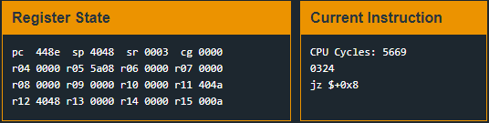

# Addis Ababa
## TLDR
This program is vulnerable to a format string vulnerability.  
The user has control over the format string to printf called from address 0x447c.  
Use this vulnerability to overwrite the instruction at 0x448e to prevent the jump over unlock_door.  

## Details
The LockIT Pro b.03  is the first of a new series  of locks. It is
controlled by a  MSP430 microcontroller, and is  the most advanced
MCU-controlled lock available on the  market. The MSP430 is a very
low-power device which allows the LockIT  Pro to run in almost any
environment.

The  LockIT  Pro   contains  a  Bluetooth  chip   allowing  it  to
communiciate with the  LockIT Pro App, allowing the  LockIT Pro to
be inaccessable from the exterior of the building.

There  is no  default  password  on the  LockIT  Pro HSM-1.   Upon
receiving the  LockIT Pro,  a new  password must  be set  by first
connecting the LockitPRO HSM to  output port two, connecting it to
the LockIT Pro App, and entering a new password when prompted, and
then restarting the LockIT Pro using the red button on the back.
    
LockIT Pro Hardware  Security Module 1 stores  the login password,
ensuring users  can not access  the password through  other means.
The LockIT Pro  can send the LockIT Pro HSM-1  a password, and the
HSM will  return if the password  is correct by setting  a flag in
memory.
  
This is Hardware  Version B.  It contains  the Bluetooth connector
built in, and two available  ports: the LockIT Pro Deadbolt should
be  connected to  port  1,  and the  LockIT  Pro  HSM-1 should  be
connected to port 2.

This is Software Revision 03. We have improved the security of the
lock by ensuring passwords can not be too long.

## Solution
Start on main. This program looks different than the previous revisions. First, the main function does not return. This rules out a stack buffer overflow overwriting the return address. Next is the use of printf instead of puts to print out to the I/O Console. This leads me to believe that there may be a format string vulnerability present.

Let's look at our calls to printf.


There are 3 calls to printf in main. The only call that takes user input is at instruction address 0x447c. We can see the contents by setting a breakpoint before the call.


The first argument on the stack points to the start of the user supplied buffer. This is a very insecure way to call printf. All user input should be evaluated before being passed to any format string function. Allowing a user to define the format specifiers gives them the control to read from or write to memory.

https://web.ecs.syr.edu/~wedu/Teaching/cis643/LectureNotes_New/Format_String.pdf

I wanted to start by reversing the printf function to see what format parameters are handled. The only ones are %s, %x, and %n. You can find my notes on printf [here](https://github.com/networking101/microcorruption/blob/main/Addis%20Ababa/printf_reverse.txt).

Let's play around with this, start by sending "%x%x%x%x%x%x%x%x". This will let us read 8 words off the stack starting after the first argument (bytes at 0x4048 - 0x4058).


It's hard to read but we printed out "7825" 7 times. If we look at our memory dump the first word at address 0x4048 is null so nothing was printed to the console for that address.

We know we can reach the vulnerability. So, what do we do with it?

The %n format parameter will write bytes to memory. We can use this to patch an instruction and change execution. The jz at instruction address 0x448e is used to skip over the unlock_door call if the password test fails. This would be a good instruction to roll through.

The %n parameter works by writing the number of bytes already printed to the address that %n references on the stack. This means that one of our %x from our test earlier (not the first one due to null bytes at the address) can store address 0x448e and a %n pointing to that location will overwrite the jump.

Now we need to figure out what to write. We are limited by the number of characters we can pass into printf. The call to getsn at instruction address 0x445c will only read 0x13 bytes from the user. We can use %s (4 bytes each) to read long strings and there is a long string starting at 0xff80. However, we shouldn't need much since we just need an instruction that will prevent a jump. Turn to the disassembler for some instructions and remember we are in little endian.


In the MSP430 instruction set the rrc instruction means rotate right (1 bit) through carry. We probably don't want to change the pc, sp, or sr. The instruction for opcode 0x0300 (rrc #0x0) seems like a good candidate. (What is the point of doing rrc on 0? Am I missing something here? Oh well.)

Never mind. I executed opcode 0x0300 and the processor broke, we need to find something else.

We are left with rrc on registers r4 - r15. We don't want to break anything that could crash execution before we get the door unlocked so let's pick something that looks unused. Set a breakpoint before the jz (instruction address 0x448e) and let's take a look.



It looks like r4, and r6-r10 are set to 0 and unused in main. Let's use r4.

To exploit this vulnerability, we will need to first print out 4 bytes. 2 of these bytes will be the address we will patch and the other 2 will be garbage. There are 2 bytes of nulls on our stack so next we will need a %x parameter to skip over address 0x4048. (this will not print any bytes and will not affect the value written with %n). Finally, our %n parameter which will point at address 0x404a. A visual of the stack and its values can be seen below.

```
       STACK
       ------
0x4046 |4a40| $sp
0x4048 |0000|
0x404a |8e44| address to overwrite (start of user input)
0x404c |ffff| junk
0x404e |2578| "%x" on 0x0000 at 0x4048
0x4050 |256e| "%n" on 0x448e at 0x404a (end of user input)
       ------
```

Send it away.


Looks like it worked. We can see our length of 4 is written to address 0x448e


Continue and the door will unlock.

## Answer
Password: (hex) 8e44ffff2578256e
