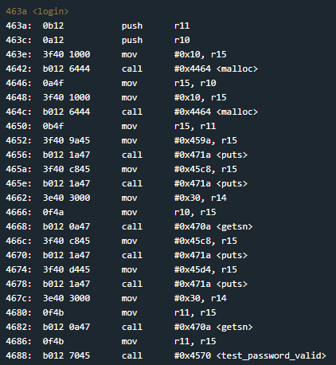
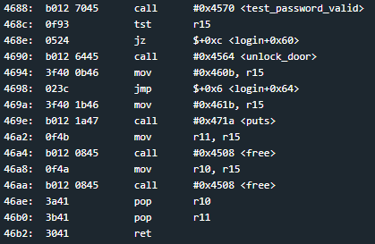
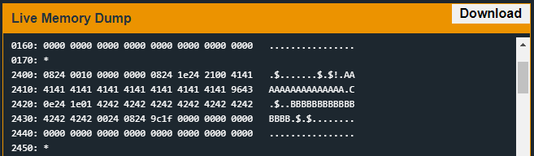

# Algiers
## TLDR

## Details
The LockIT Pro d.01  is the first of a new series  of locks. It is
controlled by a  MSP430 microcontroller, and is  the most advanced
MCU-controlled lock available on the  market. The MSP430 is a very
low-power device which allows the LockIT  Pro to run in almost any
environment.

The  LockIT  Pro   contains  a  Bluetooth  chip   allowing  it  to
communiciate with the  LockIT Pro App, allowing the  LockIT Pro to
be inaccessable from the exterior of the building.

LockIT Pro Account Manager solves the problem of sharing passwords
when  multiple users  must  have  access to  a  lock. The  Account
Manager contains  a mapping of users  to PINs, each of  which is 4
digits.  The  system supports  hundreds of users,  each configured
with his or her own PIN,  without degrading the performance of the
manager.

There are no accounts set up  on the LockIT Pro Account Manager by
default. An administrator must first initialize the lock with user
accounts  and  their  PINs.  User  accounts  are  by  default  not
authorized  for access,  but can  be authorized  by attaching  the
Account  Manager  Authorizer.  This  prevents  users  from  adding
themselves to the lock during its use.
    
This is Hardware  Version D.  It contains  the Bluetooth connector
built in, and one available port, to which the LockIT Pro Deadbolt
should be connected. When authorizing PINs, the Deadbolt should be
disconnected and the Authorizer should be attached in its place.

This   is  Software   Revision   01.  It is a  much more  advanced
version of other locks, but the first Version D release.

## Solution
Start on login.



This challenge introduces malloc and free functions. We will probably need to use a heap overflow to overwrite data on free. Looking at the function, each malloc allocates 0x10 bytes but each getsn function reads 0x30 bytes from the user. The data is not written to the stack but we can overwrite heap buffer metadata. Check where free happens on the buffers.



The second buffer is freed first. This gives us the ability to abuse the second buffer's metadata with the first call the getsn.

I wanted to start by reversing the malloc and free functions. You can find my notes on these functions [here](https://github.com/networking101/microcorruption/blob/main/Algiers/heap_functions_reverse.txt).

https://guyinatuxedo.github.io/25-heap/index.html

This programs heap manager uses a double linked list that starts at address 0x2400. Each buffer contains 6 bytes of metadata that consists of a previous buffer, a next buffer, and a size. The pointers to previous and next point to the start of the metadata, not the allocated buffer. The least significant bit of the size indicates if the buffer is allocated or free.

We know that we need to use a buffer overflow on heap buffer address 0x240e to overwrite metadata on heap buffer address 0x2424. Then we will use the first call to overwrite the login return address to point to the unlock door function. Now that we know what we want to accomplish, the question is what do we write and where do we write it.

This took some time to figure out. We can't use the previous and next pointers to hold data we want to write because they will overwrite those memory regions with garbage. We can use them to point to data we want to overwrite.

The trick is to use the buffer size parameters and some 2^16 math to write the unlock_door address over the login return address on the stack. Here are the steps.

1) Make the free command think the allocated buffer at 0x240e is already freed. We will do this by setting 0x241e (buffer 2 previous pointer) to 0x4396. *(0x4396 + 4) is 0x4404 which has its least significant bit set to 0.
2) Combine the sizes of buffer1 and buffer2 to overwrite the return address stored on the stack at address 0x439a with value 0x4564.
3) Ensure the free command does not try to merge the current buffer with the next buffer (only if the next buffer is free). The easiest way to ensure this is by pointing to a buffer that has not been unallocated (0x240e).

With all of these requirements met, we can overwrite the return address.  Lets take a look at our buffers in memory.



Here is a visual of the heap space.

```
        HEAP
       ------
0x2400 |0824| address of first buffer (0x2408)
0x2402 |0010| 0x100 bytes of allocable memory
0x2404 |0000| Indicates if any memory has been allocated
0x2406 |0000| NULLs
0x2408 |0824| username buffer previous pointer (points to self because first buffer)
0x240a |1e24| username buffer next pointer
0x240c |2100| username buffer size
0x240e |4141| junk
        ....
0x241e |9643| password buffer previous pointer (points to 4 bytes before address we want to overwrite)
0x2420 |0e24| password buffer next pointer (needs to point to a buffer that is allocated or whos least significant bit of 4th byte is set)
0x2422 |1e01| password buffer size (this value + 6 + value at *(0x4396 + 4) equals 0x4564 which is the address we want to jump to)
0x2424 |4242| junk
       ------
```

Lets try to explain what is happening here. The first free gets called at 0x46a4. It will free the block of heap memory at 0x2424. 

## Answer
Username: (hex) 4141414141414141414141414141414196430e241e01
Password: (hex) 42424242424242424242424242424242
