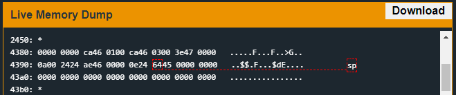

# Algiers
## TLDR
This program is vulnerable to a heap buffer overflow.  
A heap unlink exploit is used to write data to an arbitrary memory address during a call to free.  
This exploit will replace the login return value on the stack with the unlock_door function address.  

## Details
The LockIT Pro d.01  is the first of a new series  of locks. It is
controlled by a  MSP430 microcontroller, and is  the most advanced
MCU-controlled lock available on the  market. The MSP430 is a very
low-power device which allows the LockIT  Pro to run in almost any
environment.

The  LockIT  Pro   contains  a  Bluetooth  chip   allowing  it  to
communiciate with the  LockIT Pro App, allowing the  LockIT Pro to
be inaccessable from the exterior of the building.

LockIT Pro Account Manager solves the problem of sharing passwords
when  multiple users  must  have  access to  a  lock. The  Account
Manager contains  a mapping of users  to PINs, each of  which is 4
digits.  The  system supports  hundreds of users,  each configured
with his or her own PIN,  without degrading the performance of the
manager.

There are no accounts set up  on the LockIT Pro Account Manager by
default. An administrator must first initialize the lock with user
accounts  and  their  PINs.  User  accounts  are  by  default  not
authorized  for access,  but can  be authorized  by attaching  the
Account  Manager  Authorizer.  This  prevents  users  from  adding
themselves to the lock during its use.
    
This is Hardware  Version D.  It contains  the Bluetooth connector
built in, and one available port, to which the LockIT Pro Deadbolt
should be connected. When authorizing PINs, the Deadbolt should be
disconnected and the Authorizer should be attached in its place.

This   is  Software   Revision   01.  It is a  much more  advanced
version of other locks, but the first Version D release.

## Solution
Start on login.


This challenge introduces malloc and free functions. We will probably need to use a heap overflow to write data on free. Looking at the function, each malloc allocates 0x10 bytes but each getsn function reads 0x30 bytes from the user. The data is not written to the stack but we can overwrite heap buffer metadata. Check where free happens on the buffers.


The second buffer is freed first. This allows us to overflow the username buffer to change the password buffer's metadata.

I wanted to start by reversing the malloc and free functions. You can find my notes on these functions [here](https://github.com/networking101/microcorruption/blob/main/Algiers/heap_functions_reverse.txt).

Also check out guyinatuxedo's unlink explanation.

[https://guyinatuxedo.github.io/25-heap/index.html](https://guyinatuxedo.github.io/30-unlink/unlink_explanation/index.html)

### Heap Allocation Summary
This program's heap manager uses a double linked list that starts at address 0x2408. Each buffer contains 6 bytes of metadata that consists of a previous pointer, a next pointer, and a size. The pointers to previous and next point to the start of the metadata, not the allocated buffer. Finally, the least significant bit of the size indicates if the buffer is allocated or free.

When malloc is called, the function will search for the first available block that is large enough to hold the allocated buffer and the block metadata. If the size is a precise fit, the block will be allocated. Otherwise, the block will be split to allocate only the space required. The previous and next pointers will be updated to keep a complete chain of record of all blocks on the heap.

When free is called, the function will use the previous pointer to check if the previous block in the linked list is unallocated. If it is, we can combine that block with the currently freeing block to create a large block of contiguous, unallocated memory. Next, the free function will check the next pointer and try to combine if that next block is also unallocated. During this procedure, the previous pointer, next pointer, and block size are updated for all affected nodes.

### Exploit
We know that we need to use a buffer overflow on heap buffer address 0x240e to overwrite metadata on heap buffer address 0x2424. Then we will use the first free call to overwrite the login return address to point to the unlock door function. Now that we know what we want to accomplish, what do we write and where do we write it?

This took some time to figure out. We can't use the previous and next pointers to hold data we want to write (jump address) because they will overwrite those memory regions with garbage. However, we can use them to point to the data we want to overwrite (return address on stack).

The trick is to use the buffer size parameters and some 2^16 math to write the unlock_door address over the login return address on the stack. Here are the necessary steps when freeing the password buffer.

1) Make the free function think the previous node is unallocated space. We will do this by setting 0x241e (password buffer previous pointer) to 0x4396. *(0x4396 + 4) is 0x4404 which has its least significant bit set to 0.
2) Combine the sizes of the username buffer and password buffer to overwrite the return address stored on the stack at address 0x439a with value 0x4564.
3) Ensure the free function does not try to merge the password buffer with the next buffer in the linked list. The easiest way to ensure this is by pointing to a buffer that has not been unallocated (in this case 0x240e).

With all of these requirements met, we can overwrite the return address.  Let's take a look at our buffers in memory.


Here is a visual of the heap space with our exploit triggering the vulnerability.

```
        HEAP
       ------
0x2400 |0824| address of first buffer (0x2408)
0x2402 |0010| 0x100 bytes of allocable memory
0x2404 |0000| Indicates if any memory has been allocated
0x2406 |0000| NULLs
0x2408 |0824| username buffer previous pointer (points to self because first buffer)
0x240a |1e24| username buffer next pointer (points to password buffer)
0x240c |2100| username buffer size
0x240e |4141| junk
        ....
0x241e |9643| MODIFIED password buffer previous pointer (points to 4 bytes before address we want to overwrite)
0x2420 |0e24| MODIFIED password buffer next pointer (needs to point to a buffer that is allocated or who's least significant bit of 4th byte is set)
0x2422 |1e01| MODIFIED password buffer size (this value + 6 + value at *(0x4396 + 4) equals 0x4564 which is the address we want to jump to)
0x2424 |4242| junk
       ------
```

Let's try to explain what is happening here. The first free gets called at instruction address 0x46a4. It will attempt to free the block of heap memory at 0x2424. Within this block we have a previous pointer at address 0x241e, a next pointer at address 0x2420, and a block size at address 0x2422. (note the least significant bit of the block size is not set. This means that the block is not allocated. Fortunately, the free function does not check this before attempting to free)

The free command will start by trying to merge the previous node with the currently freeing password block. The previous pointer points to address 0x4396 on the stack. If we were to cast this memory space to a heap block, the size value at address 0x439a is 0x4440 and appears to be unallocated, Therefore the free function will attempt to merge the blocks of memory into one contiguous block. When the blocks are merged, the size is updated to reflect the total size of the new large block. This calculation is the previous block size + block header size + password blocks size = unlock_door jump address (0x4440 + 0x6 + 0x011e = 0x4564).

We have the correct jump address written to the return address position, now we need to ensure that this value doesn't get clobbered during the rest of the free function execution. We need to prevent the free function from attempting to merge the password block with the next block in the linked list. The easiest way to do this is by pointing the next node at address 0x2420 to the username block which hasn't been freed yet.

Everything is set up and ready to modify the return address. We can see the value changed right before the return from the login function.



## Answer
Username: (hex) 4141414141414141414141414141414196430e241e01  
Password: (hex) 42424242424242424242424242424242
