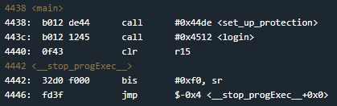
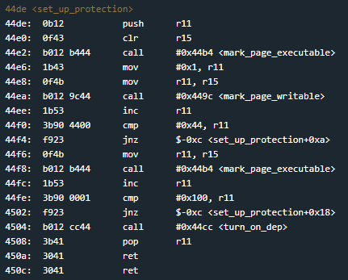
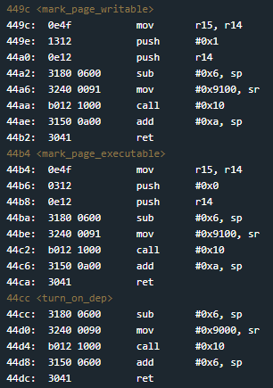
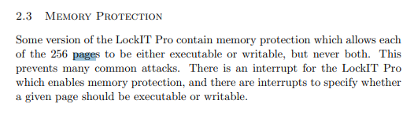
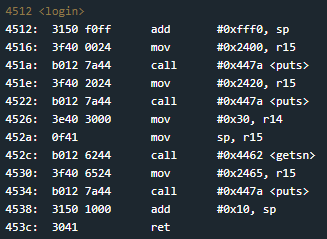
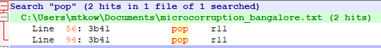
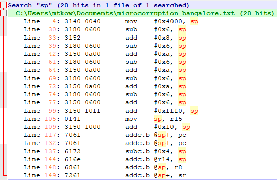
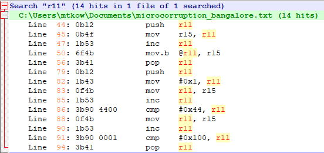
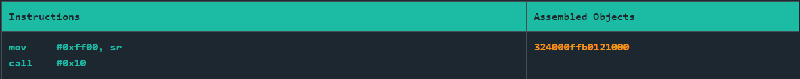
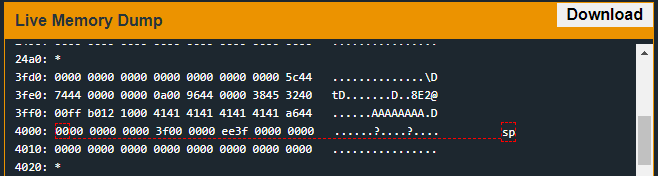

# Bangalore
## TLDR
DEP (Data Execution Prevention) is enabled.  
The program is vulnerable to a stack buffer overflow.  
Use interrupt 0x11 to make page 0x3f executable.  
Jump to the stack to execute instructions that will call interrupt 0x7f.  

## Details
The LockIT Pro c.01  is the first of a new series  of locks. It is
controlled by a  MSP430 microcontroller, and is  the most advanced
MCU-controlled lock available on the  market. The MSP430 is a very
low-power device which allows the LockIT  Pro to run in almost any
environment.

The  LockIT  Pro   contains  a  Bluetooth  chip   allowing  it  to
communiciate with the  LockIT Pro App, allowing the  LockIT Pro to
be inaccessable from the exterior of the building.

There  is no  default  password  on the  LockIT  Pro HSM-2.   Upon
receiving the  LockIT Pro,  a new  password must  be set  by first
connecting the LockitPRO HSM to  output port two, connecting it to
the LockIT Pro App, and entering a new password when prompted, and
then restarting the LockIT Pro using the red button on the back.
    
LockIT Pro Hardware  Security Module 2 stores  the login password,
ensuring users  can not access  the password through  other means.
The LockIT Pro  can send the LockIT Pro HSM-2  a password, and the
HSM will  directly send the  correct unlock message to  the LockIT
Pro Deadbolt  if the password  is correct, otherwise no  action is
taken.

Lockitall engineers  have worked for  over a year to  bring memory
protection to  the MSP430---a  truly amazing achievement.  Each of
the 256  pages can  either be executable  or writeable,  but never
both, finally  bringing to  a close  some of  the issues  in prior
versions.

This  is Hardware  Version  C. It  contains  the all-new  modified
MSP430  with hardware  memory protection.   This hardware  version
also contains the Bluetooth connector  built in, and two available
ports: the LockIT Pro Deadbolt should  be connected to port 1, and
the LockIT Pro HSM-2 should be connected to port 2.

This is Software Revision 01. The new firmware supports the memory
protection we have introduced in this new hardware version.

## Solution
Start at main.

This challenge calls a function called set_up_protection before going to login. See what's at this function.

We see multiple calls to mark_page_executable and mark_page_writable before turn_on_dep is called.

These are some interrupt calls we have not seen before. The [manual](https://github.com/networking101/microcorruption/tree/main/manual.pdf) shows that INT 0x11 will make a page only writable or executable. The first argument is the page number and the second argument indicates writable (1) or executable (0). There is a paragraph on page 3 that talks about memory protection. The total memory space (0x10000 bytes) is split into 256 pages (0x100 bytes per page). 

Looking at the setup protection function, we can determine which pages are executable and which are writable.
* 0x00 - 0xff - executable (interrupt instructions)
* 0x100 - 0x43ff - writable (stack space)
* 0x44ff - 0xffff - executable (program instructions)

Finally dep is enabled with the call to turn_on_dep.

Now lets turn to the login function.

This function is pretty straight forward. The program asks for a password, takes input from the user, and always says the password is incorrect. There is a very obvious stack buffer overflow that we can use to overwrite the return address, but we don't have an unconditional unlock door function. We also cannot jump to shellcode on the stack. We need to use ROP gadgets to chain instructions that will unlock the door.

https://www.ired.team/offensive-security/code-injection-process-injection/binary-exploitation/rop-chaining-return-oriented-programming

First look for pops.

Only pop into r11, fortunately these instructions are immediately  followed by ret which makes them good candidates for gadgets. Next look for anything with the stack pointer.

Not much here. We can add to the stack pointer easily but not subtract. Finally look for any moves from r11 into another register.

A few moves but nothing followed immediately by a ret.

My first attempt was to jump to 0x44f6 and make everything from 0x4300 - 0xffff, including the stack, executable. I thought this would work because it happens after we write our buffer with shellcode to 0x3fee. However, I quickly found out that the program still needs to write to the stack and execution was halted.

If we look at where the stack pointer resides it is usually in page 0x40 (0x4000 - 0x40ff). If we can keep the stack pointer in this range, we only need to set page 0x3f as executable. The solution I found jumps us to address 0x44a6. This will call interrupt 0x11 with both arguments on the stack. We can use our buffer overflow to set the page to 0x3f and option 0. Then any bytes of our buffer within address 0x3f00 and 0x3fff will be executable. As for our shellcode, we want to move 0xff00 into sr and call INT.

Place these bytes at the beginning of the password buffer and use a final return address to jump to stack address 0x3fee. You can see what the stack looks like when we set a breakpoint on 0x44a6.

## Answer
Password: (hex) 324000ffb01210004141414141414141a6440000000000003f000000ee3f  
