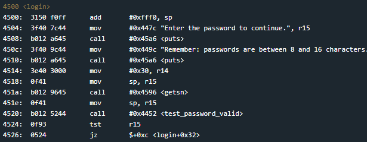
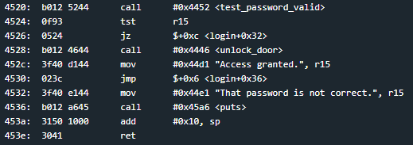
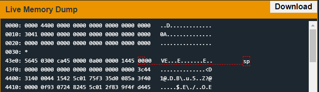

# New Orleans
## TLDR
This program is vulnerable to buffer overflow.  
The return address in the login function can be overwritten with user input.  
Jump to unlock_door function on return.  

## Details
The LockIT Pro b.02  is the first of a new series  of locks. It is
controlled by a  MSP430 microcontroller, and is  the most advanced
MCU-controlled lock available on the  market. The MSP430 is a very
low-power device which allows the LockIT  Pro to run in almost any
environment.

The  LockIT  Pro   contains  a  Bluetooth  chip   allowing  it  to
communiciate with the  LockIT Pro App, allowing the  LockIT Pro to
be inaccessable from the exterior of the building.

There  is no  default  password  on the  LockIT  Pro HSM-1.   Upon
receiving the  LockIT Pro,  a new  password must  be set  by first
connecting the LockitPRO HSM to  output port two, connecting it to
the LockIT Pro App, and entering a new password when prompted, and
then restarting the LockIT Pro using the red button on the back.
    
LockIT Pro Hardware  Security Module 1 stores  the login password,
ensuring users  can not access  the password through  other means.
The LockIT Pro  can send the LockIT Pro HSM-1  a password, and the
HSM will  return if the password  is correct by setting  a flag in
memory.
    
This is Hardware  Version B.  It contains  the Bluetooth connector
built in, and two available  ports: the LockIT Pro Deadbolt should
be  connected to  port  1,  and the  LockIT  Pro  HSM-1 should  be
connected to port 2.

This is Software Revision 02. We have improved the security of the
lock by  removing a conditional  flag that could  accidentally get
set by passwords that were too long.

## Solution
Start on login.

The user's input is stored on the stack. The I/O Console states that passwords are between 8 and 16 characters but the getsn function will read 0x30 characters.

The test_password_valid function uses interrupt 0x7d to check the password. We have no way of finding the correct password in program memory.

The result of test_password_valid is checked in the login function. We have no control of execution flow to get to access granted.

However, we can control the return address stored on the stack at address 0x43fe. If we overwrite this value, we can decide what instruction gets executed after we return from login.

We decide to jump to unlock_door at 0x4446. This function takes no arguments so we only need to add the address to the stack.

## Answer
Password: (hex) 414141414141414141414141414141414644
