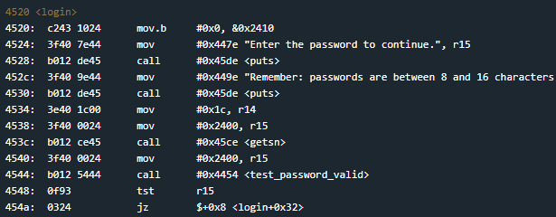
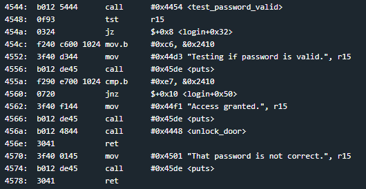

# Hanoi
## TLDR
This program is vulnerable to a stack buffer overflow.  
If the byte at address 0x2410 == 0xe7, access will be granted.  
This byte is the 17th character of user input.  

## Details
The LockIT Pro b.01  is the first of a new series  of locks. It is
controlled by a  MSP430 microcontroller, and is  the most advanced
MCU-controlled lock available on the  market. The MSP430 is a very
low-power device which allows the LockIT  Pro to run in almost any
environment.

The  LockIT  Pro   contains  a  Bluetooth  chip   allowing  it  to
communiciate with the  LockIT Pro App, allowing the  LockIT Pro to
be inaccessable from the exterior of the building.

There  is no  default  password  on the  LockIT  Pro HSM-1.   Upon
receiving the  LockIT Pro,  a new  password must  be set  by first
connecting the LockitPRO HSM to  output port two, connecting it to
the LockIT Pro App, and entering a new password when prompted, and
then restarting the LockIT Pro using the red button on the back.

LockIT Pro Hardware  Security Module 1 stores  the login password,
ensuring users  can not access  the password through  other means.
The LockIT Pro  can send the LockIT Pro HSM-1  a password, and the
HSM will  return if the password  is correct by setting  a flag in
memory.
    
This is Hardware  Version B.  It contains  the Bluetooth connector
built in, and two available  ports: the LockIT Pro Deadbolt should
be  connected to  port  1,  and the  LockIT  Pro  HSM-1 should  be
connected to port 2.

This is Software Revision 01,  allowing it to communicate with the
LockIT Pro HSM-1

## Solution
Start on login.

The user's input is stored starting at address 0x2400. The I/O Console states that passwords are between 8 and 16 characters but the getsn function will read 0x1c characters.

The test_password_valid function uses interrupt 0x7d to check the password. We have no way of finding the correct password in program memory.

The result of test_password_valid is checked in the login function. If the check failed (returned 0 in r15), we jump to 0x4552 and compare the byte at 0x2410 to 0xe7. If this byte matches, access is granted.

We can unlock the door if the 17th byte of our password input is 0xe7.

## Answer
Password: (hex) e7e7e7e7e7e7e7e7e7e7e7e7e7e7e7e7e7
