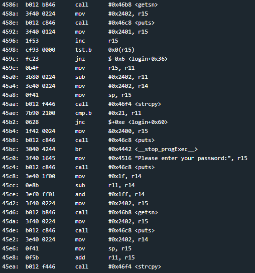
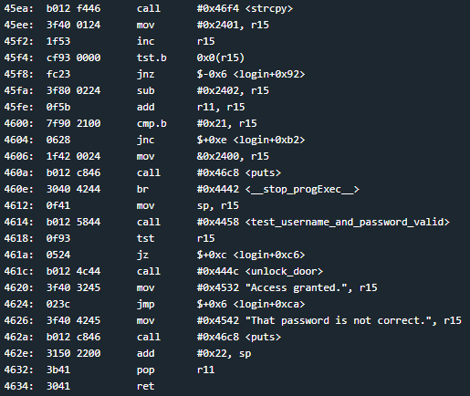
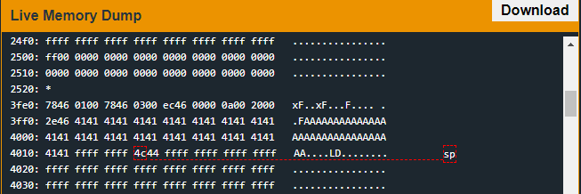

# Jakarta
## TLDR 

## Details
The LockIT Pro b.06  is the first of a new series  of locks. It is
controlled by a  MSP430 microcontroller, and is  the most advanced
MCU-controlled lock available on the  market. The MSP430 is a very
low-power device which allows the LockIT  Pro to run in almost any
environment.

The  LockIT  Pro   contains  a  Bluetooth  chip   allowing  it  to
communiciate with the  LockIT Pro App, allowing the  LockIT Pro to
be inaccessable from the exterior of the building.

There  is no  default  password  on the  LockIT  Pro HSM-1.   Upon
receiving the  LockIT Pro,  a new  password must  be set  by first
connecting the LockitPRO HSM to  output port two, connecting it to
the LockIT Pro App, and entering a new password when prompted, and
then restarting the LockIT Pro using the red button on the back.
    
LockIT Pro Hardware  Security Module 1 stores  the login password,
ensuring users  can not access  the password through  other means.
The LockIT Pro  can send the LockIT Pro HSM-1  a password, and the
HSM will  return if the password  is correct by setting  a flag in
memory.
    
This is Hardware  Version B.  It contains  the Bluetooth connector
built in, and two available  ports: the LockIT Pro Deadbolt should
be  connected to  port  1,  and the  LockIT  Pro  HSM-1 should  be
connected to port 2.

This is Software Revision 06.  We have added further mechanisms to
verify that passwords which are too long will be rejected.

## Solution
Start on login. Once again a username and password are required. This time the combined length may not be more than 32 characters. If the combined length of both user inputs is greater than 32 bytes, the program will exit.

There is an integer underflow at instruction address 0x45cc. If the length of the username is greater than 0x1f, the value stored in r14 will be -1 which is a very large unsigned number. Page 7 of the [manual](https://github.com/networking101/microcorruption/tree/main/manual.pdf) shows that the gets function takes in an unsigned int as its length. This allows the user to provide an additional 0x1ff bytes in their password.

The next vulnerability is at instruction address 0x4600. R15 contains the sum of the username and password length and will be compared against 0x21. If the combined length is greater than the max length then execution will stop. However, the instruction only checks the byte, not the word. If we provide 256 or more bytes, the byte will roll over and the check will pass.

Now we just need an address to jump to. Fortunately, the unlock_door function (0x444c) doesn't require any arguments. The return address is reachable 36 bytes after the start of the username buffer.

## Answer
Username: (hex) 4141414141414141414141414141414141414141414141414141414141414141  
Password: (hex) ffffffff4c44ffffffffffffffffffffffffffffffffffffffffffffffffffffffffffffffffffffffffffffffffffffffffffffffffffffffffffffffffffffffffffffffffffffffffffffffffffffffffffffffffffffffffffffffffffffffffffffffffffffffffffffffffffffffffffffffffffffffffffffffffffffffffffffffffffffffffffffffffffffffffffffffffffffffffffffffffffffffffffffffffffffffffffffffffffffffffffffffffffffffffffffffffffffffffffffffffffffffffffffffffffffffffffffffffffffffffffffffffffffffffffffffffffffffffffffffffffffffffffffffffffffffffffffffffffff  
