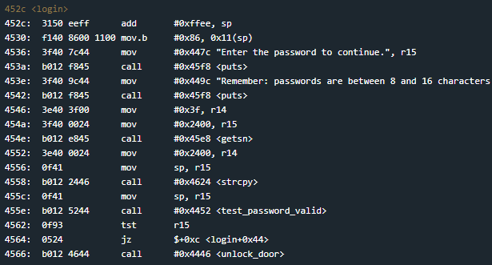
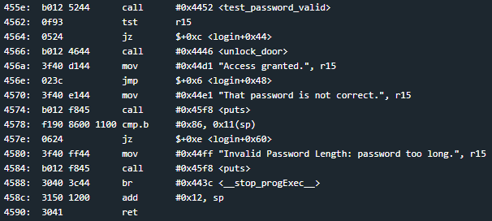
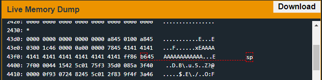

# Johannesburg
## TLDR
This program is vulnerable to a stack buffer overflow.  
The return address in the login function can be overwritten with user input.  
A stack canary of 0x86 at 0x43fd must be preserved to return from the login function.  
Jump to an int call and use 0x7f (unconditional unlock interrupt) as the first stack argument.  

## Details
The LockIT Pro b.04  is the first of a new series  of locks. It is
controlled by a  MSP430 microcontroller, and is  the most advanced
MCU-controlled lock available on the  market. The MSP430 is a very
low-power device which allows the LockIT  Pro to run in almost any
environment.

The  LockIT  Pro   contains  a  Bluetooth  chip   allowing  it  to
communiciate with the  LockIT Pro App, allowing the  LockIT Pro to
be inaccessable from the exterior of the building.

There  is no  default  password  on the  LockIT  Pro HSM-1.   Upon
receiving the  LockIT Pro,  a new  password must  be set  by first
connecting the LockitPRO HSM to  output port two, connecting it to
the LockIT Pro App, and entering a new password when prompted, and
then restarting the LockIT Pro using the red button on the back.
    
LockIT Pro Hardware  Security Module 1 stores  the login password,
ensuring users  can not access  the password through  other means.
The LockIT Pro  can send the LockIT Pro HSM-1  a password, and the
HSM will  return if the password  is correct by setting  a flag in
memory.
    
This is Hardware  Version B.  It contains  the Bluetooth connector
built in, and two available  ports: the LockIT Pro Deadbolt should
be  connected to  port  1,  and the  LockIT  Pro  HSM-1 should  be
connected to port 2.

This is Software Revision 04. We have improved the security of the
lock by ensuring passwords that are too long will be rejected.

## Solution
Start on login.

Everything looks similar to the other stack buffer overflow problems up to the test_password_valid function. After the check we see some extra code that will break our buffer overflow.

There is a stack canary at 0x43fd that gets checked at the instruction at address 0x4578. A stack canary is a security mechanism that places a preset value at the top of a function's stack. If the value is modified, the program knows that someone tried to modify memory space that they should not have write access to.

Sometimes the stack canary is dynamically set at runtime. In this case, it is a preset value that doesn't change. All we need to do is include the byte 0x86 at the correct location on the stack. This happens to be byte 18.

Now we can use the unconditional door unlock interrupt to complete this challenge. You can see our stack set up right before our return from login with the stack canary preserved.

## Answer
Password: (hex) 41414141414141414141414141414141ff86b6457f00
