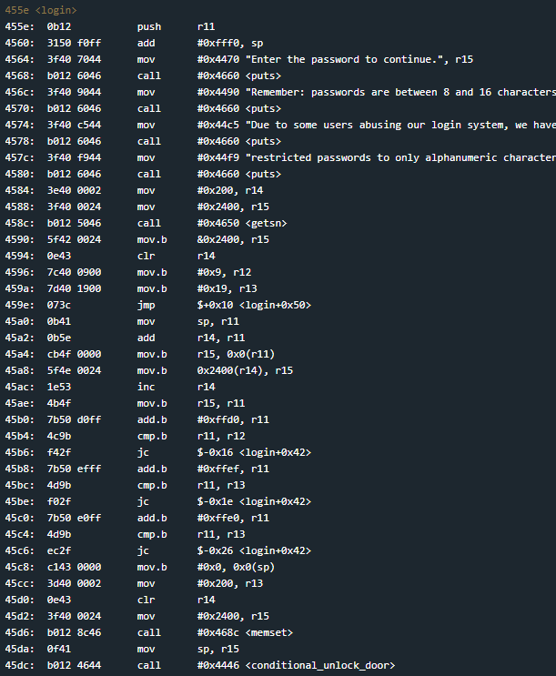
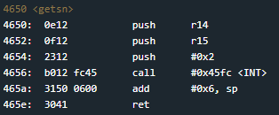

# Lagos
## TLDR

## Details
The LockIT Pro c.04  is the first of a new series  of locks. It is
controlled by a  MSP430 microcontroller, and is  the most advanced
MCU-controlled lock available on the  market. The MSP430 is a very
low-power device which allows the LockIT  Pro to run in almost any
environment.

The  LockIT  Pro   contains  a  Bluetooth  chip   allowing  it  to
communiciate with the  LockIT Pro App, allowing the  LockIT Pro to
be inaccessable from the exterior of the building.

There  is no  default  password  on the  LockIT  Pro HSM-2.   Upon
receiving the  LockIT Pro,  a new  password must  be set  by first
connecting the LockitPRO HSM to  output port two, connecting it to
the LockIT Pro App, and entering a new password when prompted, and
then restarting the LockIT Pro using the red button on the back.
    
LockIT Pro Hardware  Security Module 2 stores  the login password,
ensuring users  can not access  the password through  other means.
The LockIT Pro  can send the LockIT Pro HSM-2  a password, and the
HSM will  directly send the  correct unlock message to  the LockIT
Pro Deadbolt  if the password  is correct, otherwise no  action is
taken.
    
This is Hardware  Version C.  It contains  the Bluetooth connector
built in, and two available  ports: the LockIT Pro Deadbolt should
be  connected to  port  1,  and the  LockIT  Pro  HSM-2 should  be
connected to port 2.

This is  Software Revision  04. Due to  user confusion  over which
characters passwords may contain,  only alphanumeric passwords are
accepted.

## Solution
This time our inputs are limited to alphanumeric characters. This means we can only use the following bytes:
* 0x30 - 0x39
* 0x41 - 0x5a
* 0x61 - 0x7a

Start at login.

Our getsn reads 0x200 bytes from the user. Plenty to overflow the return address. Here we can also see the code that checks our input bytes. It doesn't seem to have any vulnerabilities.

Take a look at the getsn function.

## Answer
Password:   (hex) 41414141414141414141414141414141415446303030303030
Next input: (hex) 324000ffb0121000
