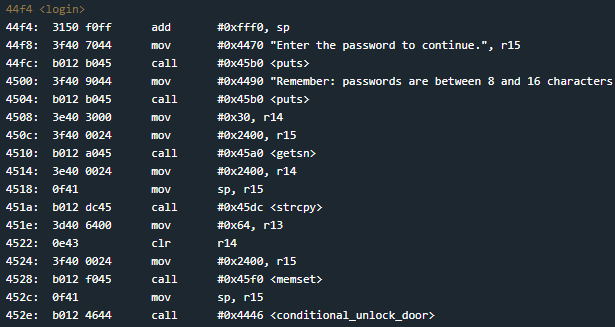
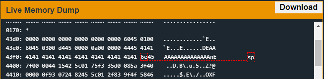

# Montevideo
## TLDR
This program is vulnerable to a stack buffer overflow.  
The return address in the login function can be overwritten with user input.  
A call to strcpy will terminate our payload at the first null byte before the end of our supplied input.  
Jump to an int call and use 0x7f (unconditional unlock interrupt) as the first stack argument.  

## Details
The LockIT Pro c.03  is the first of a new series  of locks. It is
controlled by a  MSP430 microcontroller, and is  the most advanced
MCU-controlled lock available on the  market. The MSP430 is a very
low-power device which allows the LockIT  Pro to run in almost any
environment.

The  LockIT  Pro   contains  a  Bluetooth  chip   allowing  it  to
communiciate with the  LockIT Pro App, allowing the  LockIT Pro to
be inaccessable from the exterior of the building.

There  is no  default  password  on the  LockIT  Pro HSM-2.   Upon
receiving the  LockIT Pro,  a new  password must  be set  by first
connecting the LockitPRO HSM to  output port two, connecting it to
the LockIT Pro App, and entering a new password when prompted, and
then restarting the LockIT Pro using the red button on the back.
    
LockIT Pro Hardware  Security Module 2 stores  the login password,
ensuring users  can not access  the password through  other means.
The LockIT Pro  can send the LockIT Pro HSM-2  a password, and the
HSM will  directly send the  correct unlock message to  the LockIT
Pro Deadbolt  if the password  is correct, otherwise no  action is
taken.
    
This is Hardware  Version C.  It contains  the Bluetooth connector
built in, and two available  ports: the LockIT Pro Deadbolt should
be  connected to  port  1,  and the  LockIT  Pro  HSM-2 should  be
connected to port 2.

This is Software Revision 03. We have received unconfirmed reports
of issues with the previous series of locks. We have reimplemented
much  of the  code according  to our  internal Secure  Development
Process.

## Solution
Start on login.

This looks similar to [Whitehorse](https://github.com/networking101/microcorruption/tree/main/Whitehorse). The only difference is the use of strcpy at address 0x451a to move the user supplied buffer onto the stack. If our exploit contains any null bytes, copying will stop at the first null byte and truncate any remaining bytes from our payload.

Fortunately, we didn't use any null bytes in Whitehorse and we can use the same payload. Just make sure to use a ROP gadget that will get us to the INT function. I used 0x456e.

You can see our stack set up right before our return from login.

## Answer
Password: (hex) 414141414141414141414141414141416e457f00
