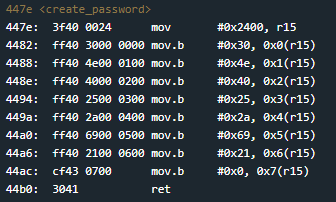

# New Orleans
## TLDR
The password is stored in create_password.
Instructions copy password one byte at a time into address 0x2400.
Function check_password compares user input to password.

## Details
The LockIT Pro a.01  is the first of a new series  of locks. It is
controlled by a  MSP430 microcontroller, and is  the most advanced
MCU-controlled lock available on the  market. The MSP430 is a very
low-power device which allows the LockIT  Pro to run in almost any
environment.

The  LockIT  Pro   contains  a  Bluetooth  chip   allowing  it  to
communiciate with the  LockIT Pro App, allowing the  LockIT Pro to
be inaccessable from the exterior of the building.

There is  no default password  on the LockIT  Pro---upon receiving
the LockIT Pro, a new password must be set by connecting it to the
LockIT Pro  App and  entering a password  when prompted,  and then
restarting the LockIT Pro using the red button on the back.
    
This is Hardware  Version A.  It contains  the Bluetooth connector
built in, and one available port  to which the LockIT Pro Deadbolt
should be connected.

This is Software Revision 01.

## Solution
Start on main. The first called is <create_password>. Stepping into this function, we see 9 mov instructions that copy bytes starting at address 0x2400.

In function check_password, user input is compared to bytes stored at address 0x2400.

## Answer
Password: (hex) 304e40252a6921
