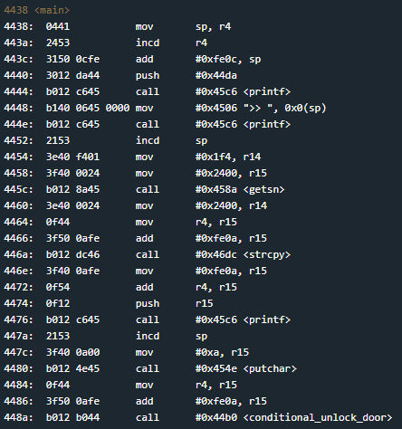
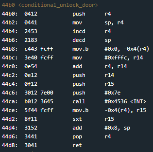

# Novosibirsk
## TLDR
This program is vulnerable to a format string vulnerability.  
The user has control over the format string to printf called from address 0x4476.  
Use this vulnerability to change the interrupt value at instruction address 0x44c8 from 0x7e00 to 0x7f00.  

## Details
The LockIT Pro c.02  is the first of a new series  of locks. It is
controlled by a  MSP430 microcontroller, and is  the most advanced
MCU-controlled lock available on the  market. The MSP430 is a very
low-power device which allows the LockIT  Pro to run in almost any
environment.

The  LockIT  Pro   contains  a  Bluetooth  chip   allowing  it  to
communiciate with the  LockIT Pro App, allowing the  LockIT Pro to
be inaccessable from the exterior of the building.

There  is no  default  password  on the  LockIT  Pro HSM-2.   Upon
receiving the  LockIT Pro,  a new  password must  be set  by first
connecting the LockitPRO HSM to  output port two, connecting it to
the LockIT Pro App, and entering a new password when prompted, and
then restarting the LockIT Pro using the red button on the back.
    
LockIT Pro Hardware  Security Module 2 stores  the login password,
ensuring users  can not access  the password through  other means.
The LockIT Pro  can send the LockIT Pro HSM-2  a password, and the
HSM will  directly send the  correct unlock message to  the LockIT
Pro Deadbolt  if the password  is correct, otherwise no  action is
taken.
    
This is Hardware  Version C.  It contains  the Bluetooth connector
built in, and two available  ports: the LockIT Pro Deadbolt should
be  connected to  port  1,  and the  LockIT  Pro  HSM-2 should  be
connected to port 2.

This is Software Revision 02. We have improved the security of the
lock by ensuring passwords can not be too long.

## Solution
Start on main.



This is a similar situation as [Addis Ababa](https://github.com/networking101/microcorruption/tree/main/Addis%20Ababa). We have a main function that doesn't return but does call printf at address 0x4476 without sanitizing user input. This time we don't have a jump instruction we can overwrite. We will need to find something else to unlock the door.

Take a look at the conditional_unlock_door function.



This function uses the 0x7e interrupt to check the password and unlock the door. If we change the interrupt to 0x7f, we won't need to provide a password. The call to getsn will read 0x1f4 bytes from the user which is plenty.

The stack setup is easy this time. We don't need a "%x" to increment to the start of the user input on the stack. A visual is provided below.

```
       STACK
       ------
0x420a |0c42| $sp
0x420c |c844| address to overwrite (start of user input)
0x420e |4141| junk
        ....
0x428a |4125| junk + "%"
0x428c |6e00| "n" + NULL
       ------
```

This exploit requires 0x81 bytes and will write 0x7f00 to instruction address 0x44c8. The wrong password will be ignored on this interrupt and the door will open.

## Answer
Password: (hex) c8444141414141414141414141414141414141414141414141414141414141414141414141414141414141414141414141414141414141414141414141414141414141414141414141414141414141414141414141414141414141414141414141414141414141414141414141414141414141414141414141414141414141256e
