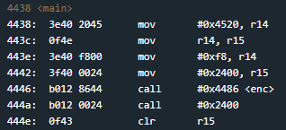
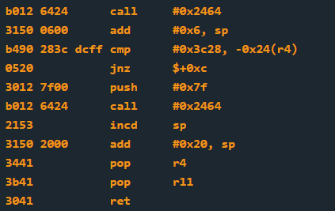

# Reykjavik
## TLDR
This program is obfuscated.  
Use the (dis)assembler to read instructions at address 0x2400.  
User input is compared to bytes 0x3c28 at address 0x2448.  

## Details
The LockIT Pro a.03  is the first of a new series  of locks. It is
controlled by a  MSP430 microcontroller, and is  the most advanced
MCU-controlled lock available on the  market. The MSP430 is a very
low-power device which allows the LockIT  Pro to run in almost any
environment.

The  LockIT  Pro   contains  a  Bluetooth  chip   allowing  it  to
communiciate with the  LockIT Pro App, allowing the  LockIT Pro to
be inaccessable from the exterior of the building.

There is  no default password  on the LockIT  Pro---upon receiving
the LockIT Pro, a new password must be set by connecting it to the
LockIT Pro  App and  entering a password  when prompted,  and then
restarting the LockIT Pro using the red button on the back.
    
This is Hardware  Version A.  It contains  the Bluetooth connector
built in, and one available port  to which the LockIT Pro Deadbolt
should be connected.

This is Software Revision 02. This release contains military-grade
encryption so users can be confident that the passwords they enter
can not be read from memory.   We apologize for making it too easy
for the password to be recovered on prior versions.  The engineers
responsible have been sacked.

## Solution
Start on main.

There's not much going on in this main function. Actually, there are not many defined instructions in this program at all. Main starts by calling a function called enc. It takes 2 arguments; address 0x2400 for argument 1 and 0xf8 for argument 2.  The enc function looks long and confusing, and I don't really want to spend the time reversing it. However, we see a call to address 0x2400 right after it in main. My guess is the code we actually care about is obfuscated and the enc function will unpack the results at address 0x2400.

The good news is we can set a breakpoint and let the debugger decrypt everything for us. The bad news is we won't have a pretty disassembly at 0x2400.

Set a breakpoint at address 0x444a and run the program to get executable memory at 0x2400. Copy the memory dump and use the (dis)assembler to see what instructions are executed.

[disassembly](disassembly.txt)

As we look through the obfuscated code it seems pretty simple. The only function that gets called is INT (at address 0x2464). The obfuscated function asks for a password and compares it to bytes 0x3c28 at address 0x2448.

Don't forget the processor is little endian. We need to provide our answer in reverse byte order.

## Answer
Password: (hex) 283c
