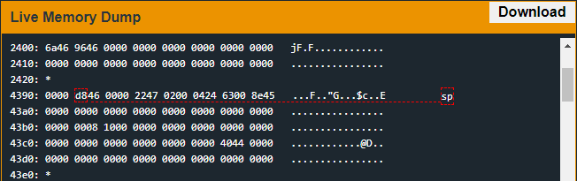
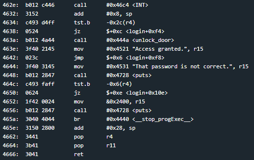

# Montevideo
## TLDR
This program is vulnerable to a stack buffer overflow.  
There is a username and password supplied by the user.  
The username buffer is used to set the minimum and maximum password lengths and set the ROP gadget.  
The password buffer is used to set the stack canary to null.  
Jump to the unlock door function.  

## Details
The LockIT Pro b.05  is the first of a new series  of locks. It is
controlled by a  MSP430 microcontroller, and is  the most advanced
MCU-controlled lock available on the  market. The MSP430 is a very
low-power device which allows the LockIT  Pro to run in almost any
environment.

The  LockIT  Pro   contains  a  Bluetooth  chip   allowing  it  to
communiciate with the  LockIT Pro App, allowing the  LockIT Pro to
be inaccessable from the exterior of the building.

There  is no  default  password  on the  LockIT  Pro HSM-1.   Upon
receiving the  LockIT Pro,  a new  password must  be set  by first
connecting the LockitPRO HSM to  output port two, connecting it to
the LockIT Pro App, and entering a new password when prompted, and
then restarting the LockIT Pro using the red button on the back.
    
LockIT Pro Hardware  Security Module 1 stores  the login password,
ensuring users  can not access  the password through  other means.
The LockIT Pro  can send the LockIT Pro HSM-1  a password, and the
HSM will  return if the password  is correct by setting  a flag in
memory.
    
This is Hardware  Version B.  It contains  the Bluetooth connector
built in, and two available  ports: the LockIT Pro Deadbolt should
be  connected to  port  1,  and the  LockIT  Pro  HSM-1 should  be
connected to port 2.

This is Software Revision 05.  We have added further mechanisms to
verify that passwords which are too long will be rejected.

## Solution
Start on login. This program now requires a username and password. The calls to getsn both allow up to 63 bytes to be read. This is more than enough to overwrite the return address on the stack. However, there are 2 checks that will stop execution. One at address 0x45ea and another at address 0x4600.

Further up we see what was being checked. A loop at address 0x45d8 - 0x45de was counting the length of the password field. It doesn't look like the length of username was verified. The check at 0x45ea ensures that the password is less than 16 bytes and greater than 7 bytes. These min and max values are pulled from the stack at addres 0x43b4 and 0x43b5.

Fortunately, we can overwrite these values with our username buffer. Min will be set by byte 18 and max will be set by byte 19. I chose to set the minimum value to 0x01 and maximum value to 0xff.

First check passed but we aren't done yet. Further down we see another stack canary check at instruction address 0x464c. The stack canary must be 0x00. 

This is where things get a little tricky. If we set this byte with our password buffer the strcpy will not allow us to copy our ROP gadget to the return address at 0x43cc. If we set this byte to anything other than null our program stops executing before we return from login.

We need to abuse buffer overflows in the username and password fields. The username will set the min and max values and will continue overflowing until it gets to address 0x43cc. Here we can write the address to unlock_door function (0x444a). The password will write garbage for 17 bytes then write a null at the 18th byte to pass the stack canary check. This will put our stack into a state that passes all checks and unlocks the door.

You can see what our stack looks like right before the return.

## Answer
Username: (hex) 414141414141414141414141414141414101ff41414141414141414141414141414141414141414141414a44
Password: (hex) 4242424242424242424242424242424242
