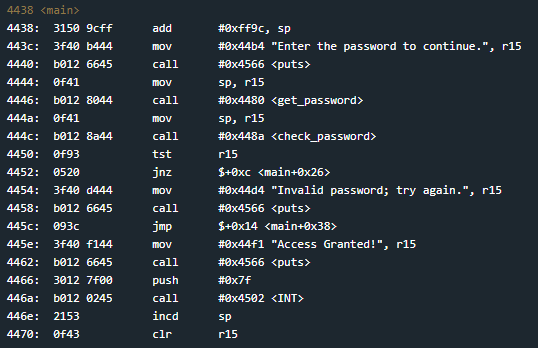
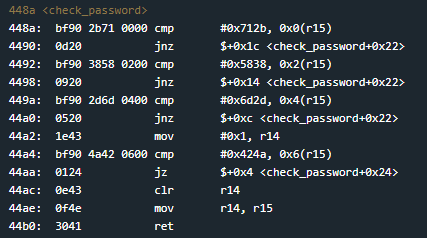

# Sydney
## TLDR
The password is stored in check_password.
Instructions compare 2 bytes at a time to user input (little endian order).
If check_password function returns anything other than 0, access is granted.

## Details
The LockIT Pro a.02  is the first of a new series  of locks. It is
controlled by a  MSP430 microcontroller, and is  the most advanced
MCU-controlled lock available on the  market. The MSP430 is a very
low-power device which allows the LockIT  Pro to run in almost any
environment.

The  LockIT  Pro   contains  a  Bluetooth  chip   allowing  it  to
communiciate with the  LockIT Pro App, allowing the  LockIT Pro to
be inaccessable from the exterior of the building.

There is  no default password  on the LockIT  Pro---upon receiving
the LockIT Pro, a new password must be set by connecting it to the
LockIT Pro  App and  entering a password  when prompted,  and then
restarting the LockIT Pro using the red button on the back.
    
This is Hardware  Version A.  It contains  the Bluetooth connector
built in, and one available port  to which the LockIT Pro Deadbolt
should be connected.

This is  Software Revision 02.  We have received reports  that the
prior  version of  the  lock was  bypassable  without knowing  the
password. We have fixed this and removed the password from memory.

## Solution
Start on main.

The user's password is read onto the stack. The next function called is check_password. This function compares 0x712b with the first 2 bytes of the string passed in as argument 1 (r15). If this check fails, r14 is cleared and we return from the function. If the check passes, we move onto the next 2 bytes.

This pattern continues until 8 bytes are checked. The user's password needs every 2 bytes to be in reverse byte order (little endian). If all 8 bytes pass each check, the function returns a 1 in r15.

Back in the main function, access will be granted if the check_password function does not return 0.

## Answer
Password: (hex) 2b7138582d6d4a42
