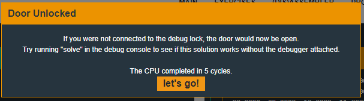

# Vladivostok
## TLDR
This program uses ASLR to randomize the stack and text sections.  
A format string vulnerability is used to leak an address of the text section.  
A buffer overflow can be used to overwrite the return address _aslr_main function.  
Use a ROP gadget to pop 0x00ff into the sr register.  
Use another ROP gadget to call INT.  

## Details
The LockIT Pro c.05  is the first of a new series  of locks. It is
controlled by a  MSP430 microcontroller, and is  the most advanced
MCU-controlled lock available on the  market. The MSP430 is a very
low-power device which allows the LockIT  Pro to run in almost any
environment.

The  LockIT  Pro   contains  a  Bluetooth  chip   allowing  it  to
communiciate with the  LockIT Pro App, allowing the  LockIT Pro to
be inaccessable from the exterior of the building.

There  is no  default  password  on the  LockIT  Pro HSM-2.   Upon
receiving the  LockIT Pro,  a new  password must  be set  by first
connecting the LockitPRO HSM to  output port two, connecting it to
the LockIT Pro App, and entering a new password when prompted, and
then restarting the LockIT Pro using the red button on the back.
   
LockIT Pro Hardware  Security Module 2 stores  the login password,
ensuring users  can not access  the password through  other means.
The LockIT Pro  can send the LockIT Pro HSM-2  a password, and the
HSM will  directly send the  correct unlock message to  the LockIT
Pro Deadbolt  if the password  is correct, otherwise no  action is
taken.

Despite the  year of development  effort which  went in to  it, we
have heard  reports that  the memory  protection introduced  in to
LockIT Pro r e.01 is insufficient. We have removed this feature in
favor of  the tried-and-true HSM-2. The  engineers responsible for
LockIT Pro r e.01 have been sacked.
    
This is Hardware  Version C.  It contains  the Bluetooth connector
built in, and two available  ports: the LockIT Pro Deadbolt should
be  connected to  port  1,  and the  LockIT  Pro  HSM-2 should  be
connected to port 2.

This is  Software Revision 05.  We have implemented  new state-of-
the-art techniques to prevent any futher lock issues.

## Solution
Start on main.


There is not much here. The rand function is called twice and a memcpy moves a large amount of memory that contains instructions to a random address. Then the function ends by jumping to r13. It looks like this challenge implements ASLR (Adress Space Layout Randomization) to obfuscate the code and to prevent an attacker from jumping to a static instruction address.

The program wipes the original instructions but we can view the disassembly before running the program.


I copied the instructions to a text file so I could view the disassembly while I debugged. You can view my file with comments [here](https://github.com/networking101/microcorruption/blob/main/Vladivostok/aslr.txt).

The ASLR program does the following:
1. calls _aslr_main
2. puts "Username (8 char max):\n"
3. puts ">>"
4. gets 0x8 bytes of username with gets
5. calls printf on the username buffer
6. puts "\nPassword\n:
7. gets 0x14 bytes of password with gets
8. calls INT 0x7e on supplied password
9. puts "Wrong!\n"
10. returns to aslr_main

As I stepped through the program, the first thing I noticed is that none of the interrupts are wrapped in a calling function. We don't have a vulnerability yet, but when we do our exploit will need to mannually set up the interrupt call to unlock the door.

I also noticed the use of printf on the username buffer. Lets see if we have a format string vulnerabilty. Send "%x%x%x%x" as the username.


It works! I was considering using printf to write to memory. However, we only have 8 bytes of user buffer to work with and our memory is randomized. It is much more likely the the reason for this printf is to give us a memory leak. The address shown here (0xda8e) is within our randomized text section. When we calculate the offset, we see that it points to the start of the printf function. We can use this information to bypass ASLR.

As I keep debugging, I see that we have a buffer overflow in the password buffer. It only takes 8+ bytes to overwrite the return address in _aslr_main.

Now what do we want to jump to? I mentioned above that none of the interrupts are wrapped. All calls to int are inline with the _aslr_main function so we need to setup the stack to call INT 0x7f. My first thought was to jump to address 0x46ba. This would let us leave the interrupt (0x7f) on the stack using our buffer overflow and let execution continue at "push pc".


However, looking forward we see that the r13 register gets loaded into r15. The stack is not used to send the 0x7f interrupt. Looking at the rest of the code we see how 0x7f is passed to the interrupt handler at instructions 0x46be-0x46c8. First r13 is moved to r15 (0x46be) and r15 bytes are swapped (0x46c0). Then r15 is moved to sr (0x46c2). Next the most significant bit is set on sr (0x46c4). Finally the call is made to address 10 (0x46c8).

All we need to unlock the door is sr=0xff00 when INT is called. We can test this by setting pc to an instruction that calls 0x10 and setting sr to 0xff00. Use the "l" command to set the registers and try this yourself.

```
l pc = 454e
l sr = ff00
c
```



So now we need to find a way to set sr to 0xff00. I start looking for ROP (return-oriented programming) gadgets and fortunately there is a "pop sr; ret" gadget at address 0x4900 that will be perfect.


https://www.ired.team/offensive-security/code-injection-process-injection/binary-exploitation/rop-chaining-return-oriented-programming

But we can't call this address directly, we have to use our memory leak from printf to find the ASLR offset and calulate the address we need. This gadget is 0x196 bytes after the memory leak. Everytime we run this exploit we will need to provide a different address to get to this instruction.

Now we need a relative offset to a call to int. I chose the instruction at adress 0x46c8 which is 0xa2 bytes before the memory leak.

*NOTE: After I solved the problem I realized there is an INT function that can be called at address 0x48ec. That makes this challenge much easier. I left my original solution in here incase anyone wanted an alternate way to solve.*

Now we have all the pieces needed to exploit the door. We have a buffer overflow that will overwrite a return address, a relative address into the text section, a ROP gadget that will set sr, and a ROP gadget that will jump to an INT call. Here is a visual of our exploit on the stack.

```
        STACK
        ------
$sp     |4141| junk
         ....
$sp + 8 |0049| ROP gadget #1 (0x196 bytes after memory leak)
$sp + a |ff00| value stored at sr register (0x7f interrupt)
$sp + c |c846| ROP gadget #2 (0xa2 bytes before memory leak)
        -----
```

Remember the values shown will need to be calculated everytime the exploit is run.

## Answer
Username: (hex) 25782578  
Password: (hex) 4141414141414141<leak+0x196>00ff\<leak-0xa2>  
