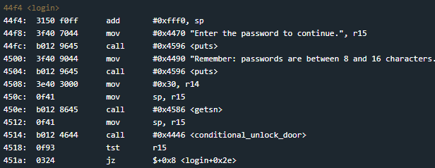

# Whitehorse
## TLDR
This program is vulnerable to a stack buffer overflow.  
The return address in the login function can be overwritten with user input.  
We don't have an unconditional unlock function this time.  
Jump to an int call and use 0x7f (unconditional unlock interrupt) as the first stack argument.  

## Details
The LockIT Pro c.01  is the first of a new series  of locks. It is
controlled by a  MSP430 microcontroller, and is  the most advanced
MCU-controlled lock available on the  market. The MSP430 is a very
low-power device which allows the LockIT  Pro to run in almost any
environment.

The  LockIT  Pro   contains  a  Bluetooth  chip   allowing  it  to
communiciate with the  LockIT Pro App, allowing the  LockIT Pro to
be inaccessable from the exterior of the building.

There  is no  default  password  on the  LockIT  Pro HSM-2.   Upon
receiving the  LockIT Pro,  a new  password must  be set  by first
connecting the LockitPRO HSM to  output port two, connecting it to
the LockIT Pro App, and entering a new password when prompted, and
then restarting the LockIT Pro using the red button on the back.
    
LockIT Pro Hardware  Security Module 2 stores  the login password,
ensuring users  can not access  the password through  other means.
The LockIT Pro  can send the LockIT Pro HSM-2  a password, and the
HSM will  directly send the  correct unlock message to  the LockIT
Pro Deadbolt  if the password  is correct, otherwise no  action is
taken.
    
This is Hardware  Version C.  It contains  the Bluetooth connector
built in, and two available  ports: the LockIT Pro Deadbolt should
be  connected to  port  1,  and the  LockIT  Pro  HSM-2 should  be
connected to port 2.

This is  Software Revision  01. The firmware  has been  updated to
connect with the new hardware security module. We have removed the
function to unlock the door from the LockIT Pro firmware.

## Solution
Start on login.

This looks similar to [Cusco](https://github.com/networking101/microcorruption/tree/main/Cusco). We overflow the buffer stored on the stack and overwrite the return address to main. However, this time we don't have an unconditional unlock door function. We will need to find a different way in.

Take a look at conditional_unlock_door.

This function calls INT with interrupt 0x7e. Read the [manual](https://github.com/networking101/microcorruption/tree/main/manual.pdf) to figure out what we need to bypass the lock.

Interrupt 0x7f is interesting. It will open the door without requiring any arguments. Looking back, this was the interrupt that Cusco used. Let's use it here.

We just need to jump to a call to INT with the bytes 0x007f at the stack pointer. Any call to INT will work. I chose address 0x4554. Here, just before the return, you can see my ROP gadget followed by 0x007f on the stack.

Be careful if you decide to jump directly to the INT function (0x4532). You will need to account for the return address stored on the stack 2 bytes before your 0x7f interrupt value.

## Answer
Password: (hex) 4141414141414141414141414141414154457f00
